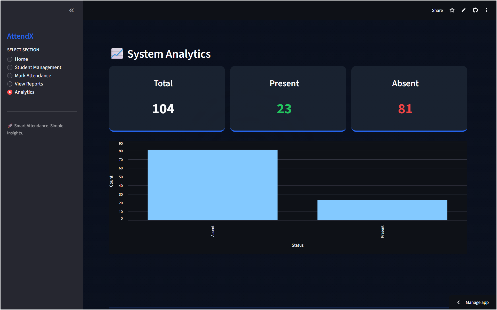

<div align="center">

# 📊 AttendX
## Smart Attendance Management System

### Modern • Simple • Analytics-Driven • Cloud-Ready

<p>
  <strong>
    A modern attendance management platform built with Python and Streamlit
    for managing students, recording attendance, and visualizing attendance insights.
  </strong>
</p>

<p>
  <a href="https://smart-attendance-system-a7xmbumokbzp45erk8my2v.streamlit.app/">
    
  </a>
  <a href="https://github.com/Ganeshbasani/smart-attendance-system">
    
  </a>
</p>

<p>
  
  
  
  
  
</p>

<p>
  <sub>Designed and developed by <strong>Ganesh Basani</strong></sub>
</p>

</div>

---

# 🚀 Live Application

<div align="center">

### 🌐 Try AttendX Online

<a href="https://smart-attendance-system-a7xmbumokbzp45erk8my2v.streamlit.app/">
  <strong>👉 Launch AttendX</strong>
</a>

<br><br>

<a href="https://github.com/Ganeshbasani/smart-attendance-system">
  <strong>⭐ View the GitHub Repository</strong>
</a>

</div>

---

# 📸 Application Showcase

> A visual walkthrough of the AttendX application interface.

### 🏠 Home

<p align="center">
  
</p>

---

### 🔐 Login

<p align="center">
  
</p>

---

### 👨‍🎓 Student Management

<p align="center">
  
</p>

---

### ✅ Attendance Management

<p align="center">
  
</p>

---

### 📈 Analytics Dashboard

<p align="center">
  
</p>

---

# 📖 Overview

**AttendX** is a modern attendance management system designed to simplify the process of maintaining student attendance records.

Traditional attendance management often depends on paper registers or manually maintained spreadsheets, which can make tracking, searching, and analyzing attendance time-consuming.

AttendX provides a centralized web-based interface where users can:

- Manage student records
- Import students using CSV files
- Search student information
- Mark students as Present or Absent
- Maintain attendance records
- Calculate attendance percentages
- Analyze attendance statistics
- Generate daily, monthly, and yearly summaries

The application combines **Python, Streamlit, Pandas, Plotly, HTML, and CSS** to provide a lightweight and interactive attendance management experience.

---

# 🎯 Problem Statement

Managing classroom attendance manually can introduce several practical problems:

- Paper-based attendance is difficult to maintain.
- Spreadsheet-based records can become inconsistent.
- Finding individual student records takes time.
- Attendance calculations are often performed manually.
- Generating reports requires repetitive work.
- Historical attendance trends are difficult to visualize.
- Teachers need a simple interface instead of complex administrative software.

### 💡 Solution

AttendX addresses these problems by providing a centralized application that allows attendance data to be recorded, processed, analyzed, and displayed through a single interface.

---

# ✨ Key Features

### 🔐 Authentication

- Teacher registration
- Teacher login
- Session-based authentication
- Protected application sections
- Logout functionality

### 👨‍🎓 Student Management

- Add and manage student records
- Import student information from CSV
- Student search
- Student information display
- Student attendance initialization

### ✅ Attendance Tracking

- Present / Absent marking
- Interactive attendance interface
- Attendance status management
- Attendance record storage
- Date-based attendance tracking

### 📊 Analytics

- Total student count
- Present student count
- Absent student count
- Attendance percentage
- Present vs Absent analysis
- Interactive charts
- Attendance trends

### 📅 Reports

- Daily attendance information
- Monthly attendance summaries
- Yearly attendance overview
- Attendance percentage calculations
- Attendance grade calculations

### 🎨 User Interface

- Modern dashboard interface
- Responsive layout
- Custom HTML/CSS styling
- Interactive components
- Clean navigation
- Visual data presentation

---

# 🧩 Core Modules

## 🔐 1. Authentication Module

The authentication layer manages application access.

### Responsibilities

- Teacher registration
- Login validation
- Session management
- Access control
- Logout handling

The application uses Streamlit session state to maintain the user's authentication state during an active session.

---

## 👨‍🎓 2. Student Management Module

The student management functionality provides a centralized way to maintain student information.

### Capabilities

- Import student records
- Validate student information
- Search students
- Display student details
- Initialize attendance information

Students can be imported through a CSV file using the supported data format.

---

## ✅ 3. Attendance Module

The attendance module allows users to digitally record attendance.

### Capabilities

- Select students
- Mark Present
- Mark Absent
- Store attendance records
- Track attendance by date
- Calculate attendance statistics

---

## 📈 4. Analytics Module

The analytics layer converts attendance records into meaningful statistics.

### Metrics

- Total students
- Present students
- Absent students
- Attendance percentage
- Attendance distribution
- Attendance trends

Interactive visualizations are created using Plotly.

---

## 📄 5. Reporting Module

The reporting functionality organizes attendance information into useful time-based summaries.

### Supported Views

- Daily
- Monthly
- Yearly

The system also calculates attendance percentages and corresponding attendance grades.

---

# 🔄 Application Workflow

```text
                     ┌─────────────────┐
                     │      Teacher    │
                     └────────┬────────┘
                              │
                              ▼
                     ┌─────────────────┐
                     │   Authentication│
                     └────────┬────────┘
                              │
                              ▼
                    ┌──────────────────┐
                    │ Student Management│
                    └─────────┬────────┘
                              │
                              ▼
                     ┌─────────────────┐
                     │ Mark Attendance  │
                     └────────┬────────┘
                              │
                              ▼
                    ┌──────────────────┐
                    │ Attendance Records│
                    └─────────┬────────┘
                              │
                              ▼
                  ┌───────────────────────┐
                  │ Analytics & Reporting │
                  └───────────────────────┘
```

---

# 🏗️ System Architecture

```text
┌─────────────────────────────────────────────┐
│                  User / Teacher             │
└──────────────────────┬──────────────────────┘
                       │
                       ▼
┌─────────────────────────────────────────────┐
│             Streamlit Application           │
│                                             │
│  ┌────────────┐ ┌────────────┐ ┌─────────┐ │
│  │Authentication│ │ Students │ │Attendance│ │
│  └──────┬─────┘ └─────┬──────┘ └────┬────┘ │
│         │              │             │       │
└─────────┼──────────────┼─────────────┼───────┘
          │              │             │
          └──────────────┼─────────────┘
                         │
                         ▼
                ┌─────────────────┐
                │  CSV Data Store │
                └────────┬────────┘
                         │
                         ▼
                ┌─────────────────┐
                │ Pandas Processing│
                └────────┬────────┘
                         │
                         ▼
                ┌─────────────────┐
                │ Plotly Analytics│
                └────────┬────────┘
                         │
                         ▼
                ┌─────────────────┐
                │ Reports / Charts│
                └─────────────────┘
```

---

# 🛠️ Technology Stack

| Category | Technology |
|---|---|
| Programming Language | Python |
| Web Framework | Streamlit |
| Data Processing | Pandas |
| Data Visualization | Plotly |
| Frontend Styling | HTML / CSS |
| Data Storage | CSV |
| Authentication | Streamlit Session State |
| Deployment | Streamlit Community Cloud |
| Version Control | Git / GitHub |

---

# 📂 Project Structure

```text
smart-attendance-system/
│
├── .devcontainer/
│   └── devcontainer.json
│
├── screenshots/
│   ├── home.png
│   ├── login.png
│   ├── student_management.png
│   ├── attendance.png
│   └── analytics.png
│
├── app.py
├── attendance.py
├── attendance.csv
├── students.csv
├── requirements.txt
└── README.md
```

---

# 📄 File Responsibilities

| File / Folder | Purpose |
|---|---|
| `app.py` | Main Streamlit application |
| `attendance.py` | Attendance-related processing |
| `students.csv` | Student data storage |
| `attendance.csv` | Attendance record storage |
| `screenshots/` | Application screenshots |
| `.devcontainer/` | Development container configuration |
| `requirements.txt` | Python dependencies |
| `README.md` | Project documentation |

---

# 📥 CSV Data Format

Student data should follow the required column structure used by the application.

### Example

```csv
Name,Student ID,Gender
John Doe,STU001,Male
Jane Smith,STU002,Female
Alex Johnson,STU003,Male
```

### Recommended Columns

| Column | Description |
|---|---|
| `Name` | Student's full name |
| `Student ID` | Unique student identifier |
| `Gender` | Student gender |

> Make sure the column names and data format match the application's expected input.

---

# 📊 Attendance Analytics

AttendX provides several attendance insights.

### 👥 Student Metrics

- Total students
- Present students
- Absent students

### 📈 Attendance Metrics

- Attendance percentage
- Present vs absent distribution
- Attendance trends
- Student attendance performance

### 📅 Time-Based Analysis

- Daily attendance
- Monthly summaries
- Yearly summaries

### 🎯 Attendance Grading

Attendance percentages can be converted into attendance grades based on the application's configured grading logic.

---

# 🔢 Attendance Percentage

The basic attendance percentage is calculated using:

```text
Attendance Percentage =

(Number of Present Sessions / Number of Total Sessions) × 100
```

For example:

```text
Present Sessions = 18
Total Sessions   = 20

Attendance = (18 / 20) × 100
           = 90%
```

---

# 🔒 Security & Data Handling

AttendX includes application-level controls such as:

- Login authentication
- Session-based access control
- Protected application sections
- Input validation
- Controlled navigation
- Structured data handling

### Important Note

The current application uses CSV files for data persistence.

For production environments involving sensitive institutional or student information, a dedicated database and stronger authentication infrastructure should be considered.

---

# 💾 Data Storage

The current implementation follows a lightweight local-first approach using CSV files.

```text
students.csv
      │
      ▼
Student Records
      │
      ▼
Attendance Processing
      │
      ▼
attendance.csv
      │
      ▼
Analytics & Reports
```

### Advantages

- Simple
- Lightweight
- Easy to inspect
- Easy to deploy
- No database server required

### Production Consideration

For a larger institution, the application can be migrated to:

- PostgreSQL
- MySQL
- Firebase
- Supabase
- MongoDB

---

# ☁️ Deployment

AttendX is designed to run as a Streamlit web application and can be deployed using Streamlit Community Cloud.

### Deployment Flow

```text
GitHub Repository
       │
       ▼
Streamlit Cloud
       │
       ▼
Application Build
       │
       ▼
Live Web Application
```

### Live Deployment

👉 https://smart-attendance-system-a7xmbumokbzp45erk8my2v.streamlit.app/

---

# 💻 Run Locally

## 1️⃣ Clone the Repository

```bash
git clone https://github.com/Ganeshbasani/smart-attendance-system.git
```

## 2️⃣ Navigate to the Project

```bash
cd smart-attendance-system
```

## 3️⃣ Create a Virtual Environment

### Windows

```powershell
python -m venv venv
```

Activate it:

```powershell
.\venv\Scripts\Activate.ps1
```

### macOS / Linux

```bash
python3 -m venv venv
source venv/bin/activate
```

---

## 4️⃣ Install Dependencies

```bash
pip install -r requirements.txt
```

---

## 5️⃣ Start the Application

```bash
streamlit run app.py
```

The application will open in your browser.

---

# 📦 Dependencies

The project uses Python packages listed in:

```text
requirements.txt
```

Install them using:

```bash
pip install -r requirements.txt
```

---

# 🧪 Example Usage

### Step 1 — Login

Authenticate through the application.

### Step 2 — Manage Students

Import or manage student information.

### Step 3 — Search Students

Use the student search functionality to quickly locate records.

### Step 4 — Mark Attendance

Mark each student as:

```text
Present
   or
Absent
```

### Step 5 — Analyze

Open the analytics section to review:

- Attendance percentage
- Present count
- Absent count
- Attendance distribution
- Trends

### Step 6 — Review Reports

Use the available daily, monthly, and yearly views to analyze attendance history.

---

# 🎨 UI / UX Highlights

The application focuses on a clean and accessible interface.

### Design Principles

- Simple navigation
- Clear visual hierarchy
- Responsive layouts
- Interactive controls
- Minimal learning curve
- Data-focused dashboards
- Consistent visual presentation

---

# 💡 Why AttendX?

AttendX demonstrates how a lightweight Python application can combine:

```text
Python
   +
Streamlit
   +
Pandas
   +
Plotly
   +
CSV Data
   +
Interactive UI
   ↓
Smart Attendance Management
```

The project focuses not only on functionality but also on presenting data in a way that makes attendance information easier to understand and act upon.

---

# 📈 Future Enhancements

The current architecture provides a foundation for additional capabilities.

### 🔐 Authentication

- Password hashing
- Role-based access control
- Admin accounts
- Teacher accounts
- Student accounts

### 🗄️ Database

- PostgreSQL
- MySQL
- Supabase
- Firebase

### 🤖 Intelligent Attendance

- Face recognition
- QR-code attendance
- RFID integration
- AI-based attendance prediction

### 📩 Notifications

- Email notifications
- SMS notifications
- Low-attendance alerts
- Parent notifications

### 📄 Reporting

- PDF report generation
- Excel exports
- Automated report generation
- Student-specific reports

### 📱 Platform Expansion

- Student portal
- Parent dashboard
- Mobile application
- REST API

---

# 🧠 Learning Outcomes

This project demonstrates practical experience with:

### Programming

- Python
- Functions
- Data structures
- File handling
- Application logic

### Data

- Pandas
- CSV processing
- Data cleaning
- Data transformation
- Data aggregation

### Visualization

- Plotly
- Interactive charts
- Statistical summaries
- Dashboard design

### Web Development

- Streamlit
- HTML
- CSS
- Interactive UI components

### Software Engineering

- Modular application structure
- Version control
- Git workflows
- Deployment
- Documentation

---

# 🧑‍💻 Skills Demonstrated

```text
Python
│
├── Streamlit
├── Pandas
├── Plotly
├── Data Processing
├── Data Visualization
├── Authentication
├── File Handling
├── UI/UX
├── Git & GitHub
└── Cloud Deployment
```

---

# 🚧 Current Limitations

The current version intentionally uses a lightweight architecture.

Some areas that can be improved for enterprise-scale usage include:

- Database-backed persistence
- Strong password hashing
- Role-based authorization
- Multi-user concurrency
- Audit logging
- Production-grade secret management
- Automated testing
- Scalable backend architecture

These limitations provide clear opportunities for future development and demonstrate an understanding of the difference between a lightweight prototype and an enterprise-ready system.

---

# 🗺️ Development Roadmap

```text
[x] Streamlit Application
[x] Teacher Authentication
[x] Student Management
[x] CSV Student Import
[x] Attendance Tracking
[x] Attendance Analytics
[x] Interactive Charts
[x] Attendance Reports
[x] Cloud Deployment
[x] Application Screenshots
[x] Project Documentation

[ ] Database Integration
[ ] Secure Password Hashing
[ ] Role-Based Access Control
[ ] Automated Testing
[ ] QR Attendance
[ ] Face Recognition
[ ] Notification System
[ ] PDF Reports
[ ] Mobile Application
```

---

# ⭐ Project Highlights

| Area | Implementation |
|---|---|
| Web Application | Streamlit |
| Data Processing | Pandas |
| Visualization | Plotly |
| Authentication | Session State |
| Storage | CSV |
| UI | HTML + CSS + Streamlit |
| Deployment | Streamlit Cloud |
| Version Control | Git + GitHub |

---

# 🤝 Contributing

Contributions, suggestions, and improvements are welcome.

### Contribution Workflow

```text
Fork Repository
      ↓
Create Feature Branch
      ↓
Make Changes
      ↓
Test Changes
      ↓
Commit Changes
      ↓
Create Pull Request
```

For major changes, please open an issue first to discuss the proposed improvement.

---

# 🐛 Issues & Feedback

If you discover a bug or have an idea for improving AttendX, please open an issue in the GitHub repository.

👉 https://github.com/Ganeshbasani/smart-attendance-system/issues

---

# 📜 License

This project is licensed under the **MIT License**.

You are free to use, modify, and distribute the project according to the terms of the license.

See the repository license file for complete details.

---

# 👨‍💻 Developer

<div align="center">

## Ganesh Basani

**B.Tech — Computer Science & Engineering**

**Software Developer | Data & Analytics Enthusiast**

📍 Hyderabad, Telangana, India

📧 ganeshbasani43@gmail.com

📱 +91 7386895943

<br>

<a href="https://github.com/Ganeshbasani">
  
</a>

</div>

---

# ⭐ Support the Project

If you found AttendX useful or interesting:

⭐ **Star the repository**

🍴 **Fork the project**

🐛 **Report issues**

💡 **Suggest improvements**

📢 **Share the project**

---

<div align="center">

## 🚀 AttendX

### Turning Attendance Data Into Actionable Insights.

⭐ **If you like this project, consider giving it a star!** ⭐

</div>
