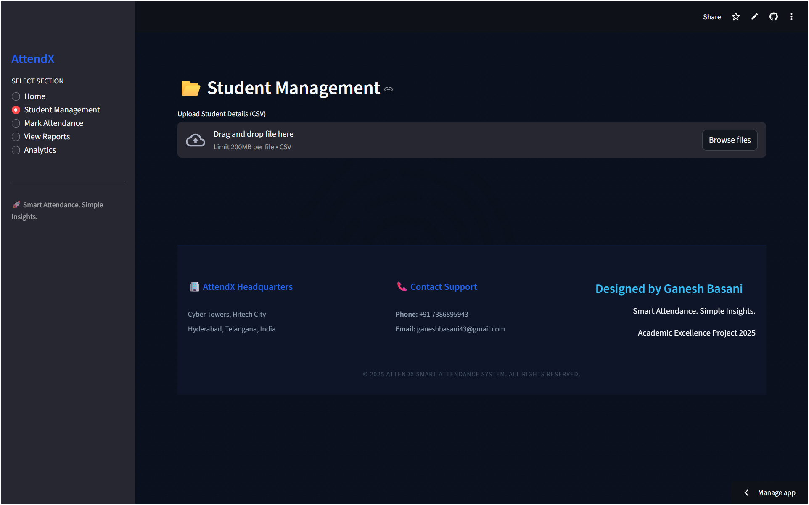
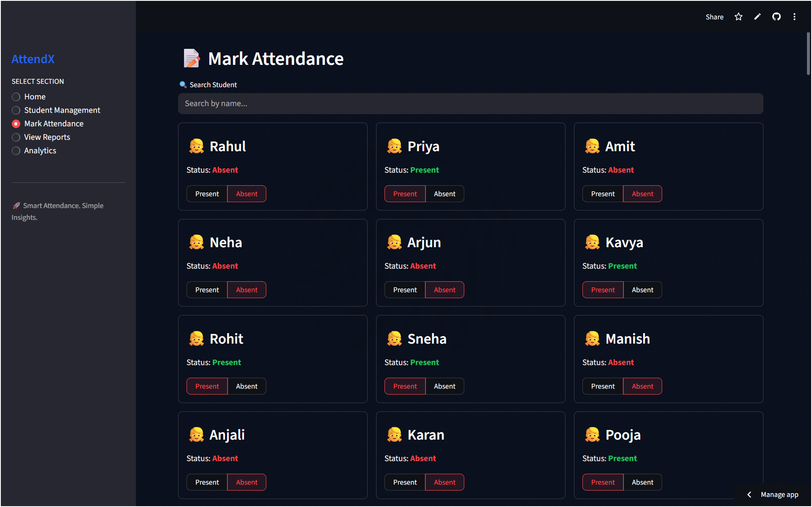

<div align="center">

# 📊 AttendX | Smart Attendance System

<p align="center">
  <strong>Modern • Intelligent • Analytics-Driven Attendance Management System</strong>
</p>

<p align="center">
A next-generation attendance management platform built with <b>Streamlit</b>, combining an intuitive user interface, secure authentication, automated attendance tracking, and real-time analytics into one powerful application.
</p>

<p align="center">


</p>

---

### 🌐 Live Demo

🔗 **https://smart-attendance-system-a7xmbumokbzp45erk8my2v.streamlit.app/**

# App Showcase
</div>







---

# 📖 Overview

AttendX is an intelligent attendance management application developed to simplify classroom attendance, automate record management, and provide actionable insights through interactive analytics.

Instead of maintaining traditional paper registers or spreadsheets, teachers can securely log into the application, upload student records, mark attendance digitally, and instantly generate attendance reports with visual dashboards.

Designed with a modern biometric-inspired interface and cloud-ready architecture, AttendX delivers a fast, responsive, and user-friendly experience suitable for educational institutions.

---

# ✨ Features

- 🔐 Secure Teacher Authentication
- 👨‍🎓 Student Management
- 📂 CSV Student Import
- ✅ Digital Attendance Marking
- 🔍 Instant Student Search
- 📈 Attendance Analytics Dashboard
- 📊 Interactive Charts
- 📅 Daily Reports
- 📆 Monthly Reports
- 🗓️ Yearly Reports
- 🎯 Automatic Attendance Grading
- 📱 Responsive User Interface

---

# 🏗️ System Architecture

```text
                    Teacher
                       │
                       â–¼
              Streamlit Web Application
                       │
        ┌──────────────┼──────────────┐
        â–¼              â–¼              â–¼
 Authentication   Student Module   Attendance Module
        │              │              │
        └──────────────┼──────────────┘
                       â–¼
                Attendance Records
                       │
                       â–¼
             Analytics & Reports
```
# ⚙️ Technology Stack

| Category | Technologies |
|-----------|--------------|
| Language | Python |
| Framework | Streamlit |
| Data Processing | Pandas |
| Visualization | Plotly |
| Styling | HTML, CSS |
| Data Storage | CSV Files |
| Authentication | Session State |
| Deployment | Streamlit Cloud |

---

# 🚀 Core Modules

## 🔐 Authentication

- Teacher Registration
- Secure Login
- Session Management
- Protected Pages
- Access Control

---

## 👨‍🎓 Student Management

- Upload Student CSV
- Automatic Validation
- Student Search
- Dynamic Student List
- Attendance Initialization

---

## ✅ Attendance Tracking

- Present / Absent Marking
- Interactive Student Cards
- Gender-Based Icons
- Real-Time Updates
- Attendance Status

---

## 📈 Analytics Dashboard

- Total Students
- Present Students
- Absent Students
- Attendance Percentage
- Interactive Charts
- Trend Analysis

---

## 📄 Reports

- Daily Attendance
- Monthly Summary
- Yearly Overview
- Attendance Percentage
- Grade Calculation
- Export Ready Reports

---

# 📊 Attendance Workflow

```text
Teacher Login
      │
      â–¼
Upload Student CSV
      │
      â–¼
Load Student Records
      │
      â–¼
Mark Attendance
      │
      â–¼
Generate Reports
      │
      â–¼
View Analytics Dashboard
```

---

# 📂 Project Structure

```text
smart-attendance-system/

├── app.py
├── pages/
│
├── assets/
│
├── screenshots/
│   ├── home.png
│   ├── login.png
│   ├── register.png
│   ├── dashboard.png
│   ├── attendance.png
│   ├── reports.png
│   └── students.png
│
├── data/
│
├── requirements.txt
│
└── README.md
```

---

# 📁 CSV Format

The uploaded CSV file should contain the following columns:

| Name | Student ID | Gender |
|------|------------|---------|
| John Doe | STU001 | Male |
| Jane Smith | STU002 | Female |

---

# 📈 Analytics

AttendX automatically generates:

- 📊 Attendance Percentage
- 📅 Daily Attendance
- 📆 Monthly Summary
- 🗓️ Yearly Overview
- 📉 Attendance Trends
- 📈 Present vs Absent Distribution
- 🎯 Attendance Grades

---

# 🔒 Security Features

- Secure Login
- Session Authentication
- Access Restricted Pages
- Data Validation
- Protected Dashboard
- Controlled Navigation

---

# 🌟 Key Benefits

- Easy to Use
- Modern UI
- Fast Performance
- Automated Attendance
- Interactive Dashboard
- Real-Time Analytics
- Lightweight Application
- Cloud Deployable

---

# 🚀 Future Enhancements

- Face Recognition Attendance
- QR Code Attendance
- RFID Integration
- Firebase Database
- Email Notifications
- Student Portal
- Parent Dashboard
- PDF Report Generation
- AI Attendance Prediction
- Mobile Application

---

# 🎓 Learning Outcomes

This project demonstrates practical knowledge of:

- Python Programming
- Streamlit Development
- Data Processing with Pandas
- Interactive Dashboard Design
- Session Authentication
- Data Visualization
- UI/UX Design
- Software Engineering Principles

---

# 👨‍💻 Developer

## Ganesh Basani

**Lead Developer & UI Designer**

🎓 B.Tech Computer Science & Engineering

📧 ganeshbasani43@gmail.com

📱 +91 7386895943

🌐 Hyderabad, Telangana, India

---

# 📜 License

This project is developed for educational and demonstration purposes.

© 2025 Ganesh Basani. All Rights Reserved.

---

<div align="center">

## ⭐ If you like this project, don't forget to give it a Star!

</div>

