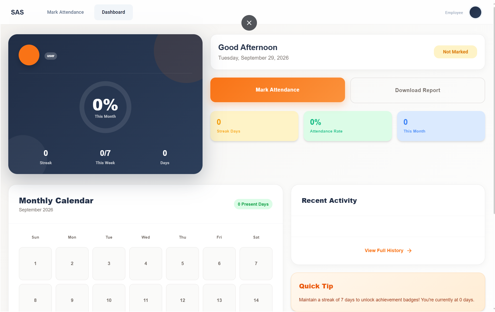
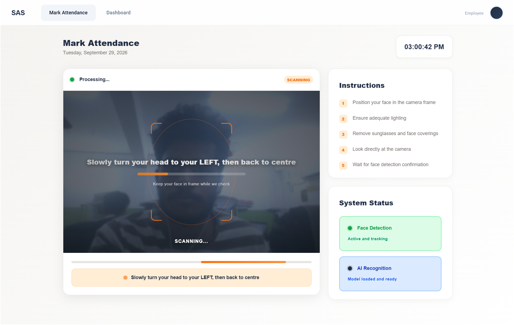
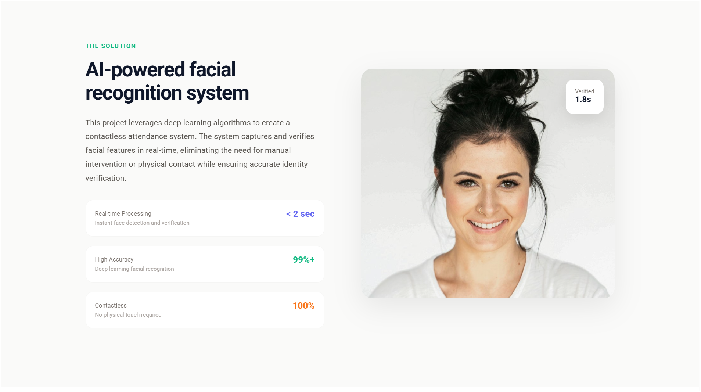
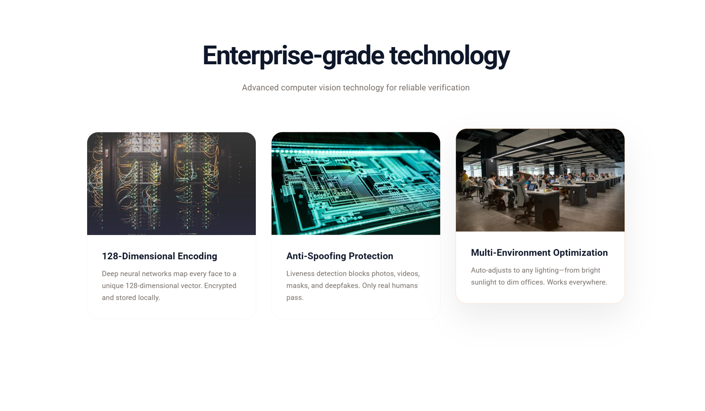
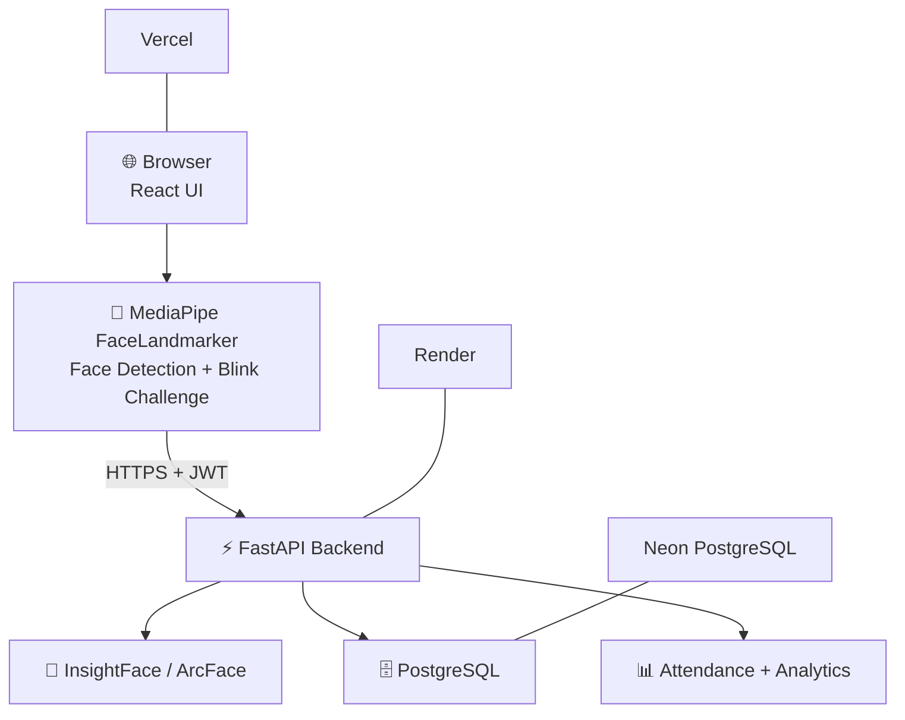

<div align="center">

# 🚀 Smart Attendance System


<p>
  <strong>A full-stack attendance platform combining face recognition, active liveness verification, JWT authentication, admin controls, and analytics.</strong>
</p>

<p>
  <a href="https://smart-attendance-system-ecru-one.vercel.app">
    
  </a>
  <a href="https://smart-attendance-system-2-oaz3.onrender.com/docs">
    
  </a>
  <a href="https://github.com/Ganeshbasani/smart-attendance-system">
    
  </a>
</p>

<p>
  
  
  
  
  
  
  
</p>

</div>

---

## 🌐 Live System

| Layer | Live URL |
|---|---|
| 🚀 **Web Application** | **https://smart-attendance-system-ecru-one.vercel.app** |
| ⚡ **Backend API** | **https://smart-attendance-system-2-oaz3.onrender.com** |
| 📖 **Swagger / OpenAPI** | **https://smart-attendance-system-2-oaz3.onrender.com/docs** |
| 💻 **GitHub Repository** | **https://github.com/Ganeshbasani/smart-attendance-system** |

> **Note:** the backend is hosted on a free-tier service, so an inactive instance can require a short warm-up period before responding.

---

## 🖼️ Product Preview

The repository includes the five supplied application screenshots under `assets/screenshots/`.

|  |  |
|---|---|
|  |  |
|  |  |
|  | |

---

## ✨ Why this project is interesting

This is more than a basic CRUD attendance application. The workflow combines browser-side computer vision, backend biometric matching, authentication, persistence, analytics, and cloud deployment into one end-to-end system.

### Core workflow

```text
Camera
  ↓
Face Detection
  ↓
Active Blink / Liveness Challenge
  ↓
Frame Quality Checks
  ↓
InsightFace / ArcFace Matching
  ↓
Identity Verification
  ↓
Attendance Record
  ↓
Analytics & Admin Reporting
```

---

## 🧠 Key Features

### 👤 Face Recognition
- InsightFace-based recognition
- ArcFace embeddings
- Multi-image enrollment
- Cosine similarity matching
- Multi-frame agreement before marking
- Identity-locked verification for authenticated users

### 👁️ Active Liveness Detection
- Browser-side MediaPipe FaceLandmarker
- Blink-based challenge
- Liveness state participates in the attendance flow
- Designed to reduce simple photo-based attempts

### 🛡️ Authentication & Security
- JWT authentication
- User and admin roles
- Password hashing
- Production secret validation
- Rate limiting
- Security headers
- Configurable CORS

### 📊 Attendance & Analytics
- Automatic attendance marking
- Attendance history
- Trend analysis
- Punctuality information
- Anomaly-oriented analytics
- Reports and CSV export

### 🧑‍💼 Admin Management
- User management
- Attendance management
- Face management
- Registered-face gallery
- Paginated administrative views

### 🗄️ Data Persistence
- PostgreSQL in deployment
- SQLite option for local development
- SQLAlchemy ORM
- Alembic migrations
- Face embeddings and enrollment images persisted in the database

---

## 🏗️ Architecture


```mermaid
flowchart TD
    A["🌐 Browser<br/>React UI"] --> B["🎥 MediaPipe FaceLandmarker<br/>Face Detection + Blink Challenge"]
    B -->|HTTPS + JWT| C["⚡ FastAPI Backend"]
    C --> D["🧠 InsightFace / ArcFace"]
    C --> E["🗄️ PostgreSQL"]
    C --> F["📊 Attendance + Analytics"]

    V["Vercel"] --- A
    R["Render"] --- C
    N["Neon PostgreSQL"] --- E
```

### Deployment topology

```text
                    ┌───────────────────────┐
                    │       Vercel          │
                    │   React Frontend      │
                    └───────────┬───────────┘
                                │
                         HTTPS / JWT
                                │
                                ▼
                    ┌───────────────────────┐
                    │       Render          │
                    │   FastAPI + ML API    │
                    │ InsightFace / ArcFace │
                    └───────────┬───────────┘
                                │
                                │ SQL
                                ▼
                    ┌───────────────────────┐
                    │        Neon           │
                    │     PostgreSQL        │
                    └───────────────────────┘
```

---

## 🧰 Technology Stack

| Area | Technologies |
|---|---|
| **Frontend** | React, Material UI, Framer Motion |
| **Computer Vision** | MediaPipe Tasks Vision, OpenCV |
| **Recognition** | InsightFace, ArcFace, SCRFD, ONNX Runtime |
| **Backend** | FastAPI, SQLAlchemy 2, Pydantic Settings, SlowAPI |
| **Authentication** | JWT, python-jose, bcrypt |
| **Database** | PostgreSQL, SQLite |
| **Migrations** | Alembic |
| **DevOps** | Docker, Docker Compose, GitHub Actions |
| **Deployment** | Vercel, Render, Neon |

---

## 📁 Repository Structure

```text
smart-attendance-system/
│
├── backend/
│   ├── app/
│   │   ├── api/
│   │   │   ├── deps.py
│   │   │   └── routers/
│   │   ├── core/
│   │   ├── db/
│   │   ├── models/
│   │   ├── schemas/
│   │   └── services/
│   ├── alembic/
│   ├── scripts/
│   ├── Dockerfile
│   └── requirements.txt
│
├── frontend/
│   ├── public/
│   ├── src/
│   │   ├── components/
│   │   └── services/
│   ├── Dockerfile
│   └── vercel.json
│
├── assets/
│   └── screenshots/
│       ├── 01.png
│       ├── 02.png
│       ├── 03.png
│       ├── 04.png
│       └── 05.png
│
├── .github/
│   └── workflows/
│       └── ci.yml
│
├── docker-compose.yml
├── LICENSE
└── README.md
```

---

## 🚀 Run It Locally

### Option 1 — Docker Compose

```bash
git clone https://github.com/Ganeshbasani/smart-attendance-system.git
cd smart-attendance-system
```

Create a root `.env`:

```env
SECRET_KEY=replace-with-a-strong-random-secret
```

Start the full stack:

```bash
docker compose up --build
```

Open:

```text
Frontend   → http://localhost:3000
API        → http://localhost:8000
Swagger    → http://localhost:8000/docs
```

---

## 💻 Development Setup

### Backend

```bash
cd backend

python -m venv .venv
```

Windows:

```powershell
.venv\Scripts\activate
```

macOS / Linux:

```bash
source .venv/bin/activate
```

Install dependencies:

```bash
pip install -r requirements.txt
```

Start API:

```bash
python -m uvicorn app.main:app --reload --port 8000
```

### Frontend

```bash
cd frontend
npm install
```

Create `frontend/.env`:

```env
REACT_APP_API_URL=http://localhost:8000
```

Start:

```bash
npm start
```

---

## ⚙️ Configuration

The backend uses environment-driven configuration.

| Variable | Purpose |
|---|---|
| `DATABASE_URL` | Database connection string |
| `SECRET_KEY` | JWT signing key |
| `ADMIN_EMAIL` | Email that receives the admin role during registration |
| `BACKEND_CORS_ORIGINS` | Allowed frontend origins |
| `APP_TIMEZONE` | Organization timezone |
| `DEBUG` | Local debug mode |
| `ACCESS_TOKEN_EXPIRE_MINUTES` | JWT lifetime |
| `RATE_LIMIT_LOGIN` | Login request throttling |
| `RATE_LIMIT_ATTENDANCE` | Attendance request throttling |
| `REACT_APP_API_URL` | Frontend build-time backend URL |

### Production frontend configuration

```env
REACT_APP_API_URL=https://smart-attendance-system-2-oaz3.onrender.com
```

### Production backend configuration

```text
DATABASE_URL=<PostgreSQL connection>
SECRET_KEY=<strong random secret>
ADMIN_EMAIL=<admin registration email>
BACKEND_CORS_ORIGINS=<Vercel application URL>
DEBUG=false
```

> Never commit production passwords, database credentials, tokens, or `.env` files.

---

## 🗄️ Database & Migrations

The schema is managed with Alembic.

Apply migrations:

```bash
cd backend
alembic upgrade head
```

Create a migration after model changes:

```bash
alembic revision --autogenerate -m "describe the change"
```

---

## 🧪 Testing

### Backend

```bash
cd backend
pytest
```

### Frontend

```bash
cd frontend
npm test -- --watchAll=false --runInBand
```

### Production build

```bash
cd frontend
npm run build
```

The repository includes GitHub Actions CI for backend tests and the frontend build.

---

## 🔐 Security & Privacy

Because the platform processes biometric information, deployment should be treated as a security-sensitive application.

Implemented application protections include:

- JWT-based authentication
- Password hashing
- Role-based authorization
- Strong production secret enforcement
- Rate limiting
- Security headers
- Configurable CORS
- Database-backed biometric records
- `.env` exclusion through Git configuration

For a higher-assurance biometric deployment, additional controls such as server-side passive anti-spoofing, stronger infrastructure isolation, audit logging, retention rules, and explicit privacy/consent policies should be considered.

---

## 🌍 Deployment

### Frontend — Vercel

```text
https://smart-attendance-system-ecru-one.vercel.app
```

### Backend — Render

```text
https://smart-attendance-system-2-oaz3.onrender.com
```

### Database — Neon

The deployed backend uses PostgreSQL hosted on Neon.

### API Documentation

```text
https://smart-attendance-system-2-oaz3.onrender.com/docs
```

---

## 🔄 End-to-End Flow

```text
┌──────────────┐
│    User      │
└──────┬───────┘
       │
       ▼
┌────────────────────┐
│ React Application  │
└─────────┬──────────┘
          │
          ▼
┌────────────────────┐
│ Face Detection     │
│ + Blink Challenge  │
└─────────┬──────────┘
          │
          ▼
┌────────────────────┐
│ FastAPI Attendance │
│ Verification API   │
└─────────┬──────────┘
          │
          ├──────────────► InsightFace / ArcFace
          │
          ▼
┌────────────────────┐
│ Identity + Frame   │
│ Agreement Checks   │
└─────────┬──────────┘
          │
          ▼
┌────────────────────┐
│ PostgreSQL Record  │
└─────────┬──────────┘
          │
          ▼
┌────────────────────┐
│ Attendance /       │
│ Analytics Views    │
└────────────────────┘
```

---

## 📌 Engineering Highlights

### Computer Vision
The application combines browser-side face detection and liveness checks with backend recognition.

### Backend Engineering
The FastAPI layer separates authentication, attendance, face handling, administration, and analytics into API routers and services.

### Database Engineering
SQLAlchemy models and Alembic migrations provide structured persistence for users, attendance records, face embeddings, and face images.

### DevOps
The project includes Docker configuration, CI workflow automation, and a cloud deployment split across Vercel, Render, and Neon.

---

## 📊 What This Demonstrates

```text
✅ Full-Stack Development
✅ REST API Design
✅ Computer Vision Integration
✅ ML Inference Integration
✅ Authentication & Authorization
✅ PostgreSQL Data Modeling
✅ Database Migrations
✅ Docker
✅ CI/CD
✅ Cloud Deployment
✅ Production Configuration
✅ Analytics
```

---

## 🔗 Quick Links

<p align="center">

<a href="https://smart-attendance-system-ecru-one.vercel.app">
  
</a>

<a href="https://smart-attendance-system-2-oaz3.onrender.com/docs">
  
</a>

<a href="https://github.com/Ganeshbasani/smart-attendance-system">
  
</a>

</p>

---

## 📜 License

This project is released under the **MIT License**. See [`LICENSE`](LICENSE) for details.

---

<div align="center">

### 🚀 Smart Attendance System

**Face Recognition • Liveness • Attendance • Analytics • Cloud Deployment**

Built with **React + FastAPI + InsightFace + PostgreSQL + Docker**

</div>
